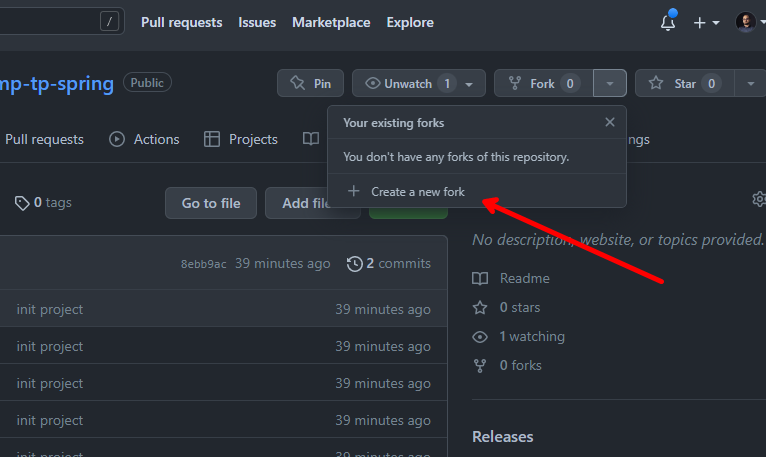
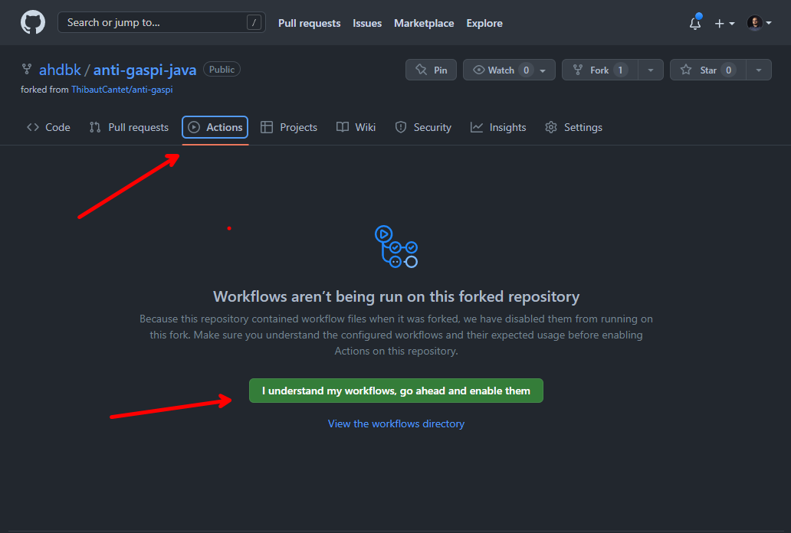

# TP CI Spring 
Hello Hello !! 👋👋


Dans ce TP on va voir ensemble comment on peut ajouter des nouvelles étapes dans une pipeline CI existante. 

Dans ces nouvelles étapes on va: 

🔴 Executer les testes unitaires de notre application

📈 Publier les résultats

## 1 - Fork le repo GitHub
Avant de commencer le TP on va faire un **Fork** du repo GiHub comme ça on aura notre propre copie du repo et du workflow existant




## 2 - Activer le worflow existant
Apres, on va cliquer sur l'onglet **Actions**.

GitHub va détecter automatiquement le dossier `.github/workflows` et nous proposer d'activer les workflow existants dans notre repo. 

(Biensur, On va pas dire non à ça 😎)



📝 La definition de notre CI est dans le fichier 
`.github/workflows/ci.yml`

## 3 - Ajouter une étape de Tests
Pas besoin de cloner le repo en local, on peut faire toute nos modifs dans l'interface GitHub. (Apres c'est comme vous voulez si vous etes un Git commande fan 🙈 )

Ajoutant ces lignes à la fin de notre fichier `ci.yaml`
```yaml
    - name: Run tests with Maven
      run: mvn test
```

⚠️ N'oubiliez pas de faire un commit pour enregister toutes les modifications qu'on vient de faire sur notre pipeline.

On va voir qu'il y a un workflow qui se lance dans la tab **Actions** avec une nouvelle step de testes


## 4 - Ajouter une étape de publication de Tests

Dans cette partie on va utiliser un tempate d'action.

[`dorny/test-reporter@v1`](https://github.com/dorny/test-reporter) va nous permetre de publier les résultats des tests exportés dans l'étape précédente dans une intérface graphique qu'on peut consulter au niveau de notre CI.

Rajoutant ces lignes à la fin de notre fichier `ci.yml`

```yaml
    - uses: dorny/test-reporter@v1
      if: success() || failure()
      with:
        name: Tests report
        path: './target/surefire-reports/*.xml'
        reporter: java-junit
```

⚠️ N'oubiliez pas de faire un commit pour enregister toutes les modifications qu'on vient de faire sur notre pipeline.

## 5 - Executer le nouveau workflow CI

Normalement, la nouvelle pipeline se lancera automatiquement si vous avez fait le commit directement sur votre branche main.


C'est bon vous pouvez ajouter Github Actions dans votre CV 🥳🥳
